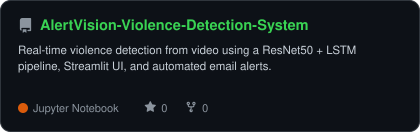
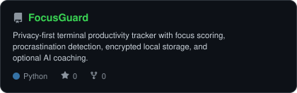
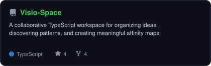

<div align="center">

<!-- PORTRAIT - generated by scripts/dotify.py from assets/portrait-source.jpg.
     Colour mode, so one file serves both GitHub themes. Regenerate with:
       python3 scripts/dotify.py assets/portrait-source.jpg -o assets/portrait \
         --cols 100 --equalize --detail 0.5 --color -->


<br>

<!-- NAME / TAGLINE - animated typing -->
<a href="https://github.com/Dhruv-Sharma29">
  
</a>

<br>

<!-- SOCIALS -->
<a href="https://www.linkedin.com/in/dhruv-sharma-ds28/"></a>
<a href="https://dhruv-sharma29.github.io/Portfolio/"></a>
<a href="https://leetcode.com/u/DhruvSharma29/"></a>

</div>

---

## `~/` whoami

```console
$ cat about.txt
```

Hi, I'm **Dhruv Sharma**, an AI Engineer and Data Scientist in training. I build production-grade
machine-learning systems, from training and experimentation to deployment and monitoring.

> Between Data and Decisions

- Currently exploring **machine learning, computer vision, LLM agents, MLOps, and data engineering**
- Portfolio: **[dhruv-sharma29.github.io/Portfolio](https://dhruv-sharma29.github.io/Portfolio/)**
- Education: **B.Tech CSE (AI & DS), Graphic Era Deemed University**

<br>

<div align="center">

## `~/` toolbox


</div>

---

<div align="center">

## `~/` contribution calendar

<!-- 3D contribution calendar, refreshed by .github/workflows/metrics.yml -->


<br><br>

<!-- Snake eats the contribution graph - .github/workflows/snake.yml -->
<picture>
  <source media="(prefers-color-scheme: dark)"  srcset="assets/github-snake-dark.svg">
  <source media="(prefers-color-scheme: light)" srcset="assets/github-snake.svg">
  
</picture>

</div>

---

<div align="center">

## `~/` skill radar

<table>
<tr>
<td width="50%" align="center" valign="middle">

<!-- Self-rated radar - edit assets/skills.json, the workflow redraws it -->
<picture>
  <source media="(prefers-color-scheme: dark)"  srcset="assets/radar-dark.svg">
  <source media="(prefers-color-scheme: light)" srcset="assets/radar-light.svg">
  
</picture>

</td>
<td width="50%" align="center" valign="middle">

<!-- Live radar built from real language byte counts across your repos -->
<picture>
  <source media="(prefers-color-scheme: dark)"  srcset="assets/radar-langs-dark.svg">
  <source media="(prefers-color-scheme: light)" srcset="assets/radar-langs-light.svg">
  
</picture>

</td>
</tr>
</table>

</div>

---

<div align="center">

## `~/` selected work

<!-- Cards generated by scripts/cards.py from assets/projects.json.
     Stars, forks and language are pulled live from the API on every run. -->
<table>
<tr>
<td width="50%">
  <a href="https://github.com/Dhruv-Sharma29/AlertVision-Violence-Detection-System">
    <picture>
      <source media="(prefers-color-scheme: dark)"  srcset="assets/card-AlertVision-Violence-Detection-System-dark.svg">
      <source media="(prefers-color-scheme: light)" srcset="assets/card-AlertVision-Violence-Detection-System-light.svg">
      
    </picture>
  </a>
</td>
<td width="50%">
  <a href="https://github.com/Dhruv-Sharma29/FocusGuard">
    <picture>
      <source media="(prefers-color-scheme: dark)"  srcset="assets/card-FocusGuard-dark.svg">
      <source media="(prefers-color-scheme: light)" srcset="assets/card-FocusGuard-light.svg">
      
    </picture>
  </a>
</td>
</tr>
<tr>
<td width="50%">
  <a href="https://github.com/Dhruv-Sharma29/Visio-Space">
    <picture>
      <source media="(prefers-color-scheme: dark)"  srcset="assets/card-Visio-Space-dark.svg">
      <source media="(prefers-color-scheme: light)" srcset="assets/card-Visio-Space-light.svg">
      
    </picture>
  </a>
</td>
</tr>
</table>

<sub>

| project | live | stack |
|---|---|---|
| **[AlertVision](https://github.com/Dhruv-Sharma29/AlertVision-Violence-Detection-System)** | [Live demo](https://huggingface.co/spaces/dhruvsharma29/AlertVision) | `Python` `TensorFlow` `OpenCV` `Streamlit` |
| **[FocusGuard](https://github.com/Dhruv-Sharma29/FocusGuard)** | — | `Python` `CLI` `SQLCipher` |
| **[Visio-Space](https://github.com/Dhruv-Sharma29/Visio-Space)** | [Live demo](https://visiospace.netlify.app/) | `TypeScript` |

</sub>

</div>

---

<div align="center">

<sub>旅は続いていく</sub>

</div>
